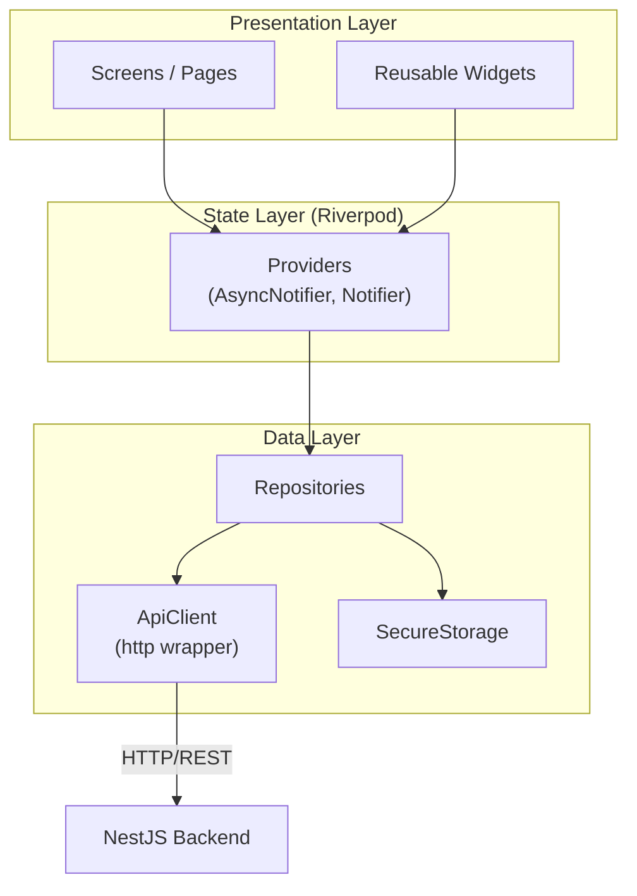

# Lock My Slot Flutter App — Implementation Plan

Mobile app (iOS + Android) for the Lock My Slot resource booking system. Separate repo from the backend.

## Tech Stack

| Concern | Choice |
|---------|--------|
| UI Framework | `shadcn_flutter` (v0.0.53) — standalone, no Material/Cupertino needed |
| State Management | `flutter_riverpod` + `riverpod_annotation` (code-gen) |
| Routing | `go_router` with `riverpod` redirect guards |
| HTTP Client | Custom lightweight service on top of `http` package |
| Local Storage | `flutter_secure_storage` (encrypted auth token) |
| Date/Time | `intl` for formatting |
| Code Gen | `build_runner` + `json_serializable` for models, `riverpod_generator` for providers |

---

## Architecture



### Layer responsibilities:

- **Presentation**: Screens, widgets, shadcn_flutter components. No business logic.
- **State (Riverpod)**: Providers that manage async state, caching, and orchestrate repository calls. Screens watch/read these.
- **Data**: `ApiClient` handles HTTP, headers, error mapping. Repositories combine API calls into domain operations. `SecureStorage` persists the auth token.

---

## Project Structure

```
lockmyslot_app/
├── lib/
│   ├── main.dart
│   ├── app.dart                          # ShadcnApp + GoRouter setup
│   │
│   ├── core/
│   │   ├── api/
│   │   │   ├── api_client.dart           # HTTP wrapper (GET/POST/PATCH/PUT/DELETE)
│   │   │   ├── api_exceptions.dart       # Typed exceptions (ApiError, ValidationError, etc.)
│   │   │   └── api_response.dart         # Generic { data, meta } envelope parser
│   │   ├── storage/
│   │   │   └── secure_storage.dart       # Auth token persistence
│   │   ├── router/
│   │   │   ├── app_router.dart           # GoRouter config + routes
│   │   │   └── route_guards.dart         # Auth redirect logic
│   │   ├── theme/
│   │   │   └── app_theme.dart            # shadcn_flutter theme config (colors, radii, etc.)
│   │   ├── constants/
│   │   │   └── api_constants.dart        # Base URL, endpoints
│   │   └── utils/
│   │       ├── date_utils.dart           # UTC ↔ local, formatting helpers
│   │       └── extensions.dart           # Dart extensions
│   │
│   ├── features/
│   │   ├── auth/
│   │   │   ├── data/
│   │   │   │   ├── auth_repository.dart
│   │   │   │   └── models/
│   │   │   │       └── user.dart
│   │   │   ├── providers/
│   │   │   │   └── auth_provider.dart
│   │   │   └── screens/
│   │   │       └── register_screen.dart
│   │   │
│   │   ├── groups/
│   │   │   ├── data/
│   │   │   │   ├── groups_repository.dart
│   │   │   │   └── models/
│   │   │   │       ├── group.dart
│   │   │   │       └── group_member.dart
│   │   │   ├── providers/
│   │   │   │   ├── groups_provider.dart
│   │   │   │   └── members_provider.dart
│   │   │   └── screens/
│   │   │       ├── groups_list_screen.dart
│   │   │       ├── group_detail_screen.dart
│   │   │       ├── create_group_screen.dart
│   │   │       ├── join_group_screen.dart
│   │   │       └── members_screen.dart
│   │   │
│   │   ├── resources/
│   │   │   ├── data/
│   │   │   │   ├── resources_repository.dart
│   │   │   │   └── models/
│   │   │   │       ├── resource.dart
│   │   │   │       └── booking_rule.dart
│   │   │   ├── providers/
│   │   │   │   ├── resources_provider.dart
│   │   │   │   └── booking_rules_provider.dart
│   │   │   └── screens/
│   │   │       ├── resources_list_screen.dart
│   │   │       ├── resource_detail_screen.dart
│   │   │       ├── create_resource_screen.dart    # Admin only
│   │   │       └── booking_rules_screen.dart      # Admin only
│   │   │
│   │   └── bookings/
│   │       ├── data/
│   │       │   ├── bookings_repository.dart
│   │       │   └── models/
│   │       │       ├── booking.dart
│   │       │       ├── availability.dart
│   │       │       └── time_slot.dart
│   │       ├── providers/
│   │       │   ├── bookings_provider.dart
│   │       │   ├── availability_provider.dart
│   │       │   └── my_bookings_provider.dart
│   │       └── screens/
│   │           ├── bookings_calendar_screen.dart   # Calendar view
│   │           ├── bookings_list_screen.dart       # List view
│   │           ├── availability_screen.dart        # Slot picker for booking
│   │           └── my_bookings_screen.dart         # User's own bookings
│   │
│   └── shared/
│       └── widgets/
│           ├── loading_overlay.dart
│           ├── error_display.dart
│           ├── empty_state.dart
│           └── confirm_dialog.dart
│
├── test/
├── pubspec.yaml
├── analysis_options.yaml
└── build.yaml                            # build_runner config
```

---

## Data Models

All models use `json_serializable` with `fieldRename: FieldRename.snake` to match the snake_case API.

### User
```dart
@JsonSerializable(fieldRename: FieldRename.snake)
class User {
  final String id;
  final String displayName;
  final String? authToken;  // only present at registration
  final DateTime createdAt;
  final DateTime updatedAt;
}
```

### Group
```dart
@JsonSerializable(fieldRename: FieldRename.snake)
class Group {
  final String id;
  final String name;
  final String? inviteCode;  // only for admins
  final String role;         // "ADMIN" | "MEMBER"
  final int memberCount;
  final DateTime createdAt;
}
```

### Resource
```dart
@JsonSerializable(fieldRename: FieldRename.snake)
class Resource {
  final String id;
  final String groupId;
  final String name;
  final String? description;
  final int capacity;
  final int slotDurationMinutes;
  final bool isActive;
  final bool? rulesConfigured;
  final DateTime createdAt;
  final DateTime updatedAt;
}
```

### BookingRule
```dart
@JsonSerializable(fieldRename: FieldRename.snake)
class BookingRule {
  final String? id;
  final String dayScope;
  final int? maxBookingsPerDay;
  final int? maxHoursPerDay;
  final int? cooldownMinutes;
  final int? minDurationMinutes;
  final int? maxDurationMinutes;
  final int? maxAdvanceBookingDays;
  final String? availableFrom;   // "HH:mm"
  final String? availableUntil;  // "HH:mm"
}
```

### Booking
```dart
@JsonSerializable(fieldRename: FieldRename.snake)
class Booking {
  final String id;
  final String resourceId;
  final String? resourceName;
  final String userId;
  final String? userDisplayName;
  final String groupId;
  final DateTime startTime;
  final DateTime endTime;
  final String status;
  final DateTime createdAt;
}
```

### Availability / TimeSlot
```dart
@JsonSerializable(fieldRename: FieldRename.snake)
class Availability {
  final String date;
  final String resourceId;
  final int slotDurationMinutes;
  final String? availableFrom;
  final String? availableUntil;
  final UserStats userStats;
  final List<TimeSlot> slots;
}

@JsonSerializable(fieldRename: FieldRename.snake)
class TimeSlot {
  final DateTime startTime;
  final DateTime endTime;
  final String status;  // "available" | "full" | "cooldown" | "unavailable"
  final int booked;
  final int capacity;
}

@JsonSerializable(fieldRename: FieldRename.snake)
class UserStats {
  final int bookingsToday;
  final double hoursToday;
  final int? maxBookingsPerDay;
  final int? maxHoursPerDay;
  final int? cooldownMinutes;
  final DateTime? lastBookingEnd;
}
```

---

## Core: ApiClient

A thin wrapper over `http` — no Dio, keeps it simple:

```dart
class ApiClient {
  final String baseUrl;
  final SecureStorage _storage;

  // Core methods
  Future<ApiResponse<T>> get<T>(String path, {Map<String, String>? query, T Function(dynamic)? fromJson});
  Future<ApiResponse<T>> post<T>(String path, {dynamic body, T Function(dynamic)? fromJson});
  Future<ApiResponse<T>> patch<T>(String path, {dynamic body, T Function(dynamic)? fromJson});
  Future<ApiResponse<T>> put<T>(String path, {dynamic body, T Function(dynamic)? fromJson});
  Future<void> delete(String path);

  // Internals
  Map<String, String> _headers(String? token);   // Authorization + Content-Type
  ApiException _handleError(http.Response res);    // Maps status codes to typed exceptions
}
```

**Error handling**: Maps HTTP status codes to typed exceptions:
- `401` → `UnauthorizedException` (redirect to login)
- `400` → `ValidationException` (with `violations` list)
- `403` → `ForbiddenException`
- `404` → `NotFoundException`
- `409` → `ConflictException` (slot full, already a member, etc.)

**Riverpod provider**:
```dart
@riverpod
ApiClient apiClient(ref) => ApiClient(
  baseUrl: ApiConstants.baseUrl,
  storage: ref.watch(secureStorageProvider),
);
```

---

## Screens & Navigation

### Route Structure

```
/                           → Redirect: logged in? → /groups, else → /register
/register                   → RegisterScreen
/groups                     → GroupsListScreen (home)
/groups/create              → CreateGroupScreen
/groups/join                → JoinGroupScreen
/groups/:group_id           → GroupDetailScreen (resources list + group info)
/groups/:group_id/members   → MembersScreen
/groups/:group_id/resources/create              → CreateResourceScreen (admin)
/groups/:group_id/resources/:resource_id        → ResourceDetailScreen
/groups/:group_id/resources/:resource_id/rules  → BookingRulesScreen (admin)
/groups/:group_id/resources/:resource_id/book   → AvailabilityScreen (slot picker)
/groups/:group_id/resources/:resource_id/bookings → BookingsCalendarScreen
/groups/:group_id/my_bookings                   → MyBookingsScreen
```

### Auth redirect

GoRouter `redirect` checks `authProvider`:
- If no token in secure storage → redirect to `/register`
- If token exists → allow navigation

---

### Screen Descriptions

#### 1. Register Screen (`/register`)
- Single text field: "What should we call you?"
- Primary button: "Get Started"
- On submit: calls `POST /auth/register`, stores token, navigates to `/groups`
- Clean, centered layout with app branding

#### 2. Groups List (`/groups`) — Home Screen
- List of user's groups as shadcn Cards
- Each card shows: group name, role badge (ADMIN/MEMBER), member count
- FAB / bottom actions: "Create Group" + "Join Group"
- Pull-to-refresh
- Empty state: illustration + "Create or join a group to get started"

#### 3. Group Detail (`/groups/:group_id`)
- Header: group name, invite code (admin only — tap to copy), member count
- Resources list below the header
- Each resource card: name, description, capacity, slot duration, active status
- Admin actions: "Add Resource" button, settings gear
- Bottom nav or tab: "Resources" | "My Bookings"

#### 4. Members Screen (`/groups/:group_id/members`)
- List of members with display name, role badge, join date
- Admin: swipe-to-remove or long-press menu → "Remove member"
- "Invite" button showing the group code with share action

#### 5. Create/Join Group
- **Create**: name text field → create
- **Join**: invite code text field (6 chars, auto-uppercase) → join

#### 6. Resource Detail (`/groups/:group_id/resources/:resource_id`)
- Resource info card: name, description, capacity, slot duration
- Active rules summary (expandable)
- "Book a Slot" primary CTA button
- "View Schedule" to see calendar
- Admin: "Edit Resource", "Configure Rules" buttons

#### 7. Booking Rules Screen (Admin) (`/groups/:group_id/resources/:resource_id/rules`)
- Tab/segmented control for day scopes: `Weekday` | `Weekend` | `Mon` | `Tue` | ... | `Sun`
- Form fields for the selected scope:
  - Max bookings per day (number input)
  - Max hours per day (number input)
  - Cooldown (minutes input)
  - Min/Max duration (minutes input)
  - Max advance booking (days input)
  - Available from/until (time pickers)
- Null/empty = "No limit" — uses shadcn Switch to toggle each constraint on/off
- "Save All Rules" button → `PUT /rules` with all configured scopes
- Visual indicator for which scopes have rules configured

#### 8. Availability / Slot Picker (`/groups/:group_id/resources/:resource_id/book`)
- Date picker at top (horizontal scrollable date strip, today highlighted)
- Slot grid below: shows all available slots for the selected date
- Each slot chip shows time range + status (available/full/cooldown/unavailable)
  - Available → tappable, green tint
  - Full → greyed out, shows "X/Y booked"
  - Cooldown → orange tint, "cooldown" label
  - Unavailable → greyed out
- User can select one or more contiguous slots to create a multi-slot booking
- Stats bar: "1/2 bookings used today · 1.5/3 hours used"
- "Confirm Booking" button after selection
- Confirmation dialog with booking summary

#### 9. Bookings Calendar (`/groups/:group_id/resources/:resource_id/bookings`)
- Toggle: Calendar View ↔ List View
- **Calendar View**: Monthly calendar, days with bookings have dots. Tap a day → shows that day's bookings in a bottom sheet or below the calendar.
- **List View**: Chronological list of upcoming bookings. Each item shows: time range, user name, status. Own bookings highlighted.
- Filter: date range picker

#### 10. My Bookings (`/groups/:group_id/my_bookings`)
- List of user's own bookings across all resources in the group
- Grouped by date
- Each item: resource name, time range, status
- Swipe or button to cancel (with confirmation)
- Filter: upcoming / past / cancelled

---

## Implementation Phases

| Phase | Scope | Estimate |
|-------|-------|----------|
| **F1** | Project setup, ApiClient, theme, router, auth flow | ~3 hours |
| **F2** | Groups (list, create, join, detail, members) | ~4 hours |
| **F3** | Resources (list, detail, create/edit, booking rules config) | ~4 hours |
| **F4** | Bookings (availability picker, create, cancel, calendar/list views) | ~6 hours |
| **F5** | My Bookings, polish, error handling, empty states | ~3 hours |

**Total: ~20 hours**

> [!NOTE]
> The Flutter app will be built in a **separate repo**. This plan is included here for reference and alignment. The backend phases (1–4) should be completed first so the app has a working API to consume.

---

## Key Dependencies (`pubspec.yaml`)

```yaml
dependencies:
  flutter:
    sdk: flutter
  shadcn_flutter: ^0.0.53
  flutter_riverpod: ^2.6.1
  riverpod_annotation: ^2.6.1
  go_router: ^14.8.1
  http: ^1.3.0
  flutter_secure_storage: ^9.2.4
  json_annotation: ^4.9.0
  intl: ^0.19.0
  
dev_dependencies:
  flutter_test:
    sdk: flutter
  build_runner: ^2.4.14
  json_serializable: ^6.9.4
  riverpod_generator: ^2.6.3
  flutter_lints: ^5.0.0
```

---

## Verification

- Test each screen against Swagger UI / backend responses
- Verify snake_case ↔ camelCase serialization
- Test auth flow: register → token stored → app restart → auto-login
- Test admin vs member visibility (rules config, remove member, etc.)
- Test booking creation with rule violations → proper error display
- Test on both iOS simulator and Android emulator
