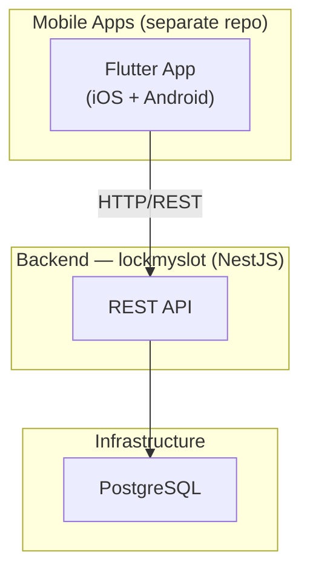
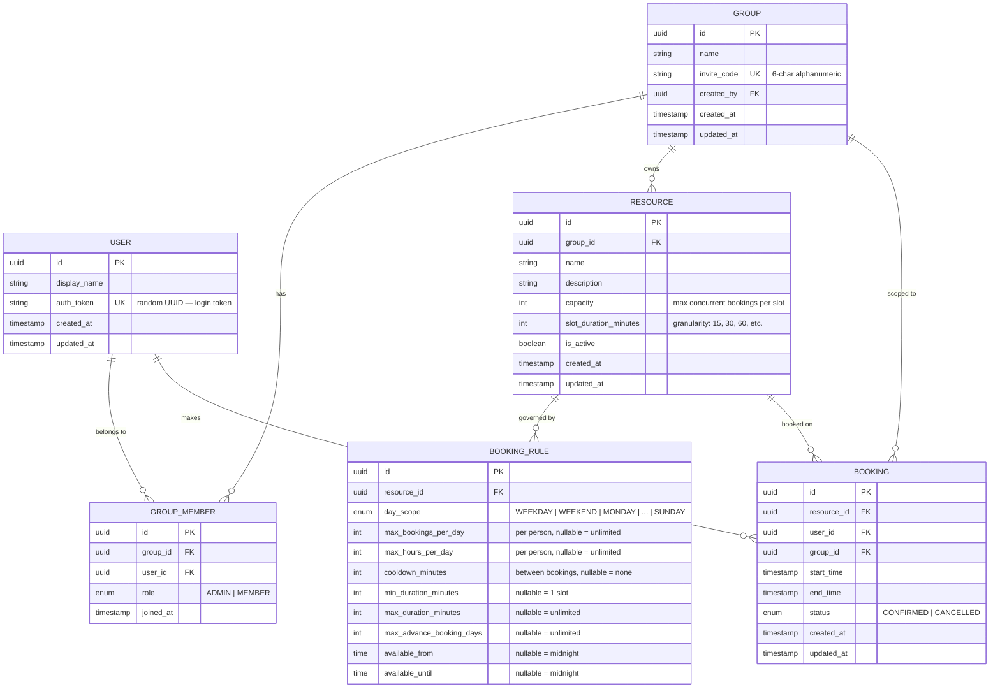

# Lock My Slot — Resource Booking App (MVP)

A multi-tenant resource booking app for small groups. Users join groups via invite codes, admins manage resources and booking rules, and members book time slots on shared resources.

---

## API Conventions

- **OpenAPI Specification 3.0** — Swagger docs auto-generated via `@nestjs/swagger` with OAS 3 output. Available at `/api/docs`.
- **snake_case everywhere** — all request/response fields, query parameters, and URL path segments use `snake_case`. NestJS DTOs will use camelCase internally with `@ApiProperty({ name: 'snake_case' })` and a serialization interceptor to transform keys.
- **Consistent envelope** — all responses wrapped in `{ data, meta }` where `meta` includes pagination info when applicable.
- **ISO 8601 timestamps** — all datetime fields as `2026-08-09T17:00:00Z`.
- **UUID v4** for all IDs.
- **HTTP status codes** — 201 for creation, 200 for reads/updates, 204 for deletes, 400 for validation errors, 401/403 for auth, 404 for not found, 409 for conflicts.

**Deferred to later phases:** Rosters/auto-booking, approval workflow, conflict detection, push notifications.

---

## Architecture Overview



---

## Data Model



### Rule priority

When a booking request comes in for, say, a Wednesday:

1. Look for a **WEDNESDAY**-specific rule → use it if found
2. Else, look for a **WEEKDAY** rule → use it if found
3. Else → no restrictions (allow the booking, only check capacity)

This lets admins set broad weekday/weekend defaults and override specific days.

---

## API Endpoints

### Auth

| Endpoint | Method | Auth | Description |
|----------|--------|------|-------------|
| `/auth/register` | POST | None | Create user with `display_name` → returns `{ data: { user, auth_token } }` |
| `/auth/me` | GET | Token | Get current user profile |
| `/auth/me` | PATCH | Token | Update `display_name` |

### Groups

| Endpoint | Method | Auth | Description |
|----------|--------|------|-------------|
| `/groups` | POST | User | Create group (creator → ADMIN) |
| `/groups` | GET | User | List my groups |
| `/groups/:id` | GET | Member | Get group details + member count |
| `/groups/join` | POST | User | Join via `invite_code` |
| `/groups/:id` | PATCH | Admin | Update group name |
| `/groups/:id/members` | GET | Member | List members |
| `/groups/:id/members/:user_id` | DELETE | Admin | Remove member |
| `/groups/:id/leave` | POST | Member | Leave group (admin can't leave if sole admin) |
| `/groups/:id/regenerate_invite` | POST | Admin | Generate new invite code |

### Resources

| Endpoint | Method | Auth | Description |
|----------|--------|------|-------------|
| `/groups/:group_id/resources` | GET | Member | List active resources |
| `/groups/:group_id/resources` | POST | Admin | Create resource |
| `/groups/:group_id/resources/:id` | GET | Member | Get resource details |
| `/groups/:group_id/resources/:id` | PATCH | Admin | Update resource |
| `/groups/:group_id/resources/:id` | DELETE | Admin | Soft-delete (set `is_active = false`) |

### Booking Rules

| Endpoint | Method | Auth | Description |
|----------|--------|------|-------------|
| `/groups/:group_id/resources/:resource_id/rules` | GET | Member | Get all rules for a resource |
| `/groups/:group_id/resources/:resource_id/rules` | PUT | Admin | Bulk upsert rules (replace all rules) |

The PUT endpoint accepts an array of rules. This makes it easy for the admin to configure all rules at once from a settings screen. Example payload:

```json
[
  {
    "day_scope": "WEEKDAY",
    "max_bookings_per_day": 2,
    "max_hours_per_day": 3,
    "cooldown_minutes": 60,
    "min_duration_minutes": 30,
    "max_duration_minutes": 120,
    "max_advance_booking_days": 7,
    "available_from": "08:00",
    "available_until": "22:00"
  },
  {
    "day_scope": "WEEKEND",
    "max_bookings_per_day": 3,
    "max_advance_booking_days": 3,
    "available_from": "10:00",
    "available_until": "20:00"
  },
  {
    "day_scope": "FRIDAY",
    "max_bookings_per_day": 1,
    "max_duration_minutes": 60,
    "available_from": "18:00",
    "available_until": "23:00"
  }
]
```

### Bookings

| Endpoint | Method | Auth | Description |
|----------|--------|------|-------------|
| `/groups/:group_id/resources/:resource_id/bookings` | GET | Member | List bookings (query: `date`, `from`, `to`) |
| `/groups/:group_id/resources/:resource_id/availability` | GET | Member | Get available slots for a date |
| `/groups/:group_id/resources/:resource_id/bookings` | POST | Member | Create booking (validates rules + capacity) |
| `/groups/:group_id/bookings/:id` | DELETE | Owner/Admin | Cancel booking |
| `/groups/:group_id/my_bookings` | GET | Member | My bookings in this group (query: `from`, `to`, `status`) |

---

## Booking Rule Evaluation Engine

The core business logic — called on every booking creation:

```
validateBooking(resourceId, userId, startTime, endTime):

  1. BASIC CHECKS
     - startTime < endTime
     - startTime is in the future
     - Duration is a multiple of slot_duration_minutes
     - Resource is active

  2. CAPACITY CHECK
     - Count existing CONFIRMED bookings overlapping [startTime, endTime]
     - If count >= resource.capacity → REJECT "slot full"

  3. RULE RESOLUTION (find applicable rule)
     - dayOfWeek = getDayOfWeek(startTime)  // e.g., WEDNESDAY
     - dayGroup = isWeekend(dayOfWeek) ? WEEKEND : WEEKDAY
     - rule = findRule(resourceId, dayOfWeek)       // day-specific first
            ?? findRule(resourceId, dayGroup)        // then day-group
            ?? null                                  // no rule = allow
     - If no rule → ALLOW (only capacity matters)

  4. RULE VALIDATION (if rule found)
     a. AVAILABILITY WINDOW
        - If rule.available_from / available_until set:
          booking must fall within [available_from, available_until]

     b. DURATION LIMITS
        - If rule.min_duration_minutes: duration >= min
        - If rule.max_duration_minutes: duration <= max

     c. ADVANCE BOOKING
        - If rule.max_advance_booking_days:
          startTime <= now + max_advance_booking_days

     d. DAILY BOOKING COUNT
        - If rule.max_bookings_per_day:
          count user's CONFIRMED bookings on same day < max

     e. DAILY HOURS
        - If rule.max_hours_per_day:
          sum of user's booked hours on same day + this duration <= max

     f. COOLDOWN
        - If rule.cooldown_minutes:
          user's nearest booking (before or after) must be >= cooldown away

  5. RETURN { allowed: true } or { allowed: false, violations: string[] }
```

---

## Project Structure

```
lockmyslot/
├── prisma/
│   ├── schema.prisma
│   └── seed.ts
├── src/
│   ├── main.ts
│   ├── app.module.ts
│   ├── common/
│   │   ├── guards/
│   │   │   └── auth.guard.ts
│   │   ├── decorators/
│   │   │   ├── current-user.decorator.ts
│   │   │   └── roles.decorator.ts
│   │   ├── interceptors/
│   │   │   └── transform.interceptor.ts
│   │   ├── filters/
│   │   │   └── http-exception.filter.ts
│   │   └── types/
│   │       └── index.ts
│   ├── prisma/
│   │   ├── prisma.module.ts
│   │   └── prisma.service.ts
│   ├── auth/
│   │   ├── auth.module.ts
│   │   ├── auth.controller.ts
│   │   ├── auth.service.ts
│   │   └── dto/
│   ├── groups/
│   │   ├── groups.module.ts
│   │   ├── groups.controller.ts
│   │   ├── groups.service.ts
│   │   ├── guards/
│   │   │   └── group-member.guard.ts
│   │   └── dto/
│   ├── resources/
│   │   ├── resources.module.ts
│   │   ├── resources.controller.ts
│   │   ├── resources.service.ts
│   │   └── dto/
│   ├── bookings/
│   │   ├── bookings.module.ts
│   │   ├── bookings.controller.ts
│   │   ├── bookings.service.ts
│   │   ├── rules.service.ts
│   │   └── dto/
│   └── booking-rules/
│       ├── booking-rules.module.ts
│       ├── booking-rules.controller.ts
│       ├── booking-rules.service.ts
│       └── dto/
├── test/
│   └── app.e2e-spec.ts
├── .env.example
├── docker-compose.yml
├── package.json
├── tsconfig.json
└── nest-cli.json
```

---

## Implementation Phases

| Phase | Scope | Estimate |
|-------|-------|----------|
| **Phase 1** | Project scaffolding, Prisma schema, Docker Compose, Swagger setup | ~1 hour |
| **Phase 2** | Auth + Groups modules (register, join, manage members) | ~2 hours |
| **Phase 3** | Resources + Booking Rules modules (CRUD, bulk upsert rules) | ~2 hours |
| **Phase 4** | Bookings module + Rule evaluation engine + availability endpoint | ~3 hours |

**Total: ~8 hours**

### Future phases (not in this build)
- Rosters & auto-booking with cron
- Approval workflow (per-resource toggle)
- Conflict detection & resolution
- Push notifications via FCM
- Admin transfer / role management

---

## Verification Plan

### Automated Tests
```bash
npm run test          # Unit tests (rule engine, services)
npm run test:e2e      # Integration tests (full API flows)
```

Key test cases for the rule engine:
- Booking within/outside availability window
- Exceeding max bookings per day
- Exceeding max hours per day
- Cooldown period violations
- Advance booking limit
- Duration min/max enforcement
- Day-specific rule overriding weekday/weekend rule
- Capacity enforcement (concurrent bookings)

### Manual Verification
- Swagger UI at `/api/docs` for interactive API testing
- Seed data with a sample group, 2 resources, rules, and bookings
- `docker compose up` for local PostgreSQL
